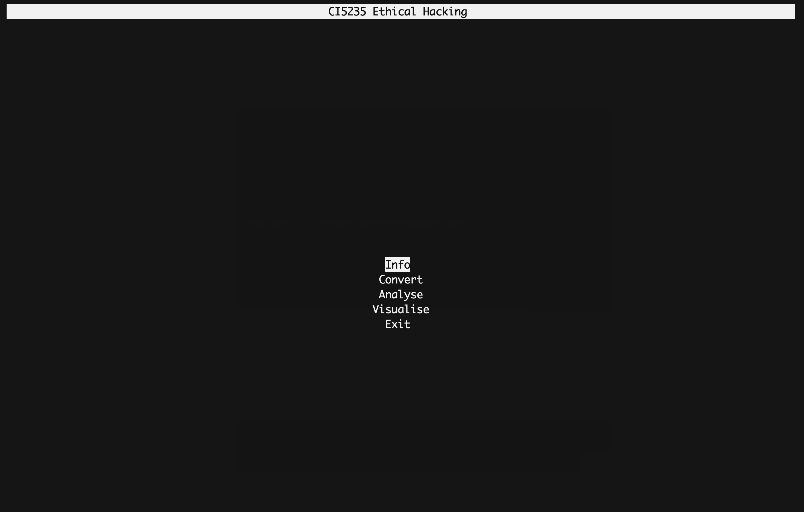

This is project folder for CI5235 - Ethical Hacking

### Project Purpose
The purpose of the project is to demonstrate curses library usage and create a terminal UI application.

### Install
- In order to run the project properly I have used `poetry` and it should be simple and easy if you use it.
- You can run the `poetry install` command and you should be ready.

- If you want to use normal pip, I have added a `requirements.txt` file as well. Run `pip install -r requirements.txt` and you should be good to go.

### Start
To run the UI, after applying the installation steps above and install necessary packages run the `/console/main_app.py` file.

### Example Screenshot of the Project
